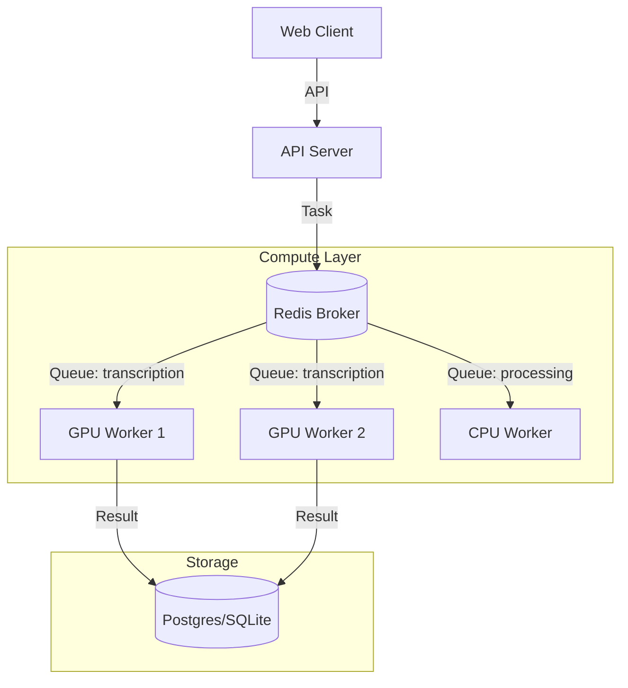

# Scaling Strategy: AI Transcription Backend

> **Principal Engineering Note:** Scaling AI workloads requires a distinct approach from typical CRUD apps. Our bottleneck is **compute urgency** (inference time) and **resource contention** (VRAM/RAM), not request throughput.

## 1. The Bottleneck Analysis
- **Current State**: Single consumer, serial processing (`pool=solo`), strictly limited by CPU cores or GPU availability.
- **Constraint**: Each transcription locks 100% of available compute resources. Parallelism on a single node causes thrashing.

## 2. Scaling Stages

### Stage 1: Queue Segregation (Low Effort, High Impact)
Don't let a 10-minute transcription block a 2-second summary.

*   **Action**: Run dedicated workers for different queues.
*   **Implementation**:
    *   **Worker A (Heavy)**: Listens to `transcription` queue. Concurrency = 1.
    *   **Worker B (Fast)**: Listens to `processing`, `maintenance` queues. Concurrency = 4 (prefork/threads).
*   **Result**: Summaries and metadata updates happen instantly, even if 50 transcriptions are queued.

### Stage 2: Horizontal Scaling (Containerization)
Scale out, not up.

*   **Action**: Deploy multiple instances of the **Worker A** container.
*   **Orchestration**: Docker Swarm (simple) or Kubernetes (production).
*   **Resource Limits**: Strict CPU/RAM limits per container to prevent neighbor noise.
*   **Note**: `pool=solo` remains the correct setting *inside* each container.

### Stage 3: Hardware Acceleration (GPU)
Shift the bottleneck from CPU time to standard VRAM cost.

*   **Action**: Deploy workers on nodes with NVIDIA GPUs.
*   **Impact**: `faster-whisper` on CUDA is 30x-50x faster than CPU.
*   **Cost Optimization**: Use "Spot Instances" (AWS/GCP) for these workers. If they die, Celery retries the task elsewhere.

## 3. Recommended Architecture Diagram

## 4. Operational Guardrails
As we scale, we must defend the system.

1.  **Timeouts**: Hardware fails. Set strict `time_limit=3600` (1 hour) on tasks.
2.  **Ack Late**: `task_acks_late=True` is mandatory. If a Spot Instance vanishes, the task must return to the queue.
3.  **Prefetch=1**: Never let a worker reserve more than one heavy task.
